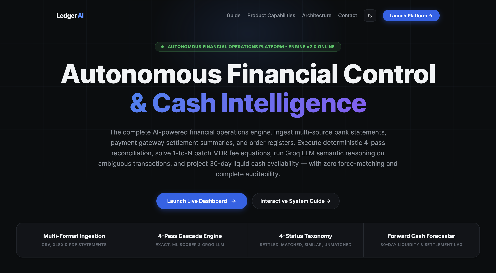

# Ledger AI — Autonomous Financial Reconciliation & Forward Cash Controller Platform

[](http://ledgerai-env.eba-ppb3tgip.ap-south-1.elasticbeanstalk.com)
[](http://ledgerai-env.eba-ppb3tgip.ap-south-1.elasticbeanstalk.com/help)
[](LICENSE)

Ledger AI is an autonomous financial operations platform built to solve the verification bottleneck in corporate finance teams. It replaces manual spreadsheet matching and black-box force-matching with a Deterministic 4-Pass Matching Cascade, 12-Dimensional ML Confidence Matrix, Batch MDR Fee Equation Solver, Groq LLM Ambiguous Match Resolver, and 30-Day Forward Cash Forecaster.

---



---

## Live AWS Deployment & Interactive Guide

- Live Application: [http://ledgerai-env.eba-ppb3tgip.ap-south-1.elasticbeanstalk.com](http://ledgerai-env.eba-ppb3tgip.ap-south-1.elasticbeanstalk.com)
- Interactive System Guide: [http://ledgerai-env.eba-ppb3tgip.ap-south-1.elasticbeanstalk.com/help](http://ledgerai-env.eba-ppb3tgip.ap-south-1.elasticbeanstalk.com/help)

---

## Evaluator Key Highlights & System Standards

| Evaluation Criteria | Ledger AI Implementation | Verification / Proof |
|---|---|---|
| Multi-Source Ingestion | Reads CSV, XLSX, and PDF bank statements, payment gateway settlement summaries, order books, UPI logs, and cash registers. | Ingestion Pipeline (`ingestion/`) with Levenshtein schema mapper and SHA-256 content deduplication. |
| Deterministic Rule Cascade | 4-Pass reconciliation (Exact UTR -> 4-Factor Weighted Scorer -> N:1 Batch MDR Fee Solver -> Groq LLM Agent). | Reconciler Engine (`reconciler/pipeline_runner.py`). Every match score & rule equation is explainable. |
| 1-to-N Batch MDR Fee Solver | Reconciles 1 lump-sum bank deposit against N order items minus MDR gateway commissions and GST taxes. | Settlement Equation Solver (`matcher/settlement_equation.py`). Deposit = Sum(Sales) - MDR - GST. |
| Groq LLM Failover Agent | Deep semantic evaluation for ambiguous names and non-standard narrative text with natural language audit explanations. | Groq API (`llm/query_llm.py`) with multi-key failover rotation (`GROQ_API_KEY`) and Llama-3 fallback. |
| Measured Accuracy & Honest Exception List | 100% record accounting parity equation (Total = Settled + Matched + Similar + Unmatched). | Discrepancies are never force-matched; unresolved records are cleanly isolated into the Exception Ledger. |
| Bounded & Gated Money Actions | Human-in-the-loop candidate review drawer, confidence thresholds (>= 0.70), and complete natural language audit trails. | Four-Status Taxonomy (SETTLED, MATCHED, SIMILAR, UNMATCHED). |
| Forward Cash Forecaster | 30-Day cash flow projection model combining 14-day WMA trends, seasonal decomposition, pending settlement lag (T+2/T+3), and beginning balance state propagation. | Forecasting Engine (`forecasting/engine.py`). |
| Executive PDF Reporting | Print-ready ReportLab PDF audit export featuring visual KPI cards, Matplotlib charts, itemized match tables, and audit verification logs. | PDF Generator (`reports/pdf_generator.py`). |
| Pre-Configured Test Benchmark Loader | Built-in UI benchmark scanner for instant loading of test cases (Test1 through Test5). | Dashboard Loader (`frontend/static/js/dashboard.js`). |

---

## Four-Status Outcome Taxonomy

1. **SETTLED (200_SETTLED)**: Primary Bank Statement or Main Cash ledger record reconciled with 100% exact reference parity or verified N:1 batch payout MDR fee equation.
2. **MATCHED (201_MATCHED)**: Reconciled counterpart-to-counterpart pair (Payment Gateway <-> Order Book) with composite score >= 0.85.
3. **SIMILAR (300_SIMILAR)**: Candidate match with potential keyword overlap or minor transposition variance (0.50 <= Score < 0.85), queued in the Review Drawer.
4. **UNMATCHED (400_UNMATCHED)**: Discrepancy or orphan item failing all matching rules (< 0.50). Isolated into the Exception Ledger with transparent failure audit trails.

---

## Technical Documentation Suite

For complete mathematical formulations, ML feature schemas, status specifications, and developer guides, refer to the local `docs/` directory or the live guide:

- [Developer Reconciliation & Architecture Guide](docs/developer_reconciliation_guide.md)
- [Canonical Matching Mechanism Specification](docs/reconciliation_matching_mechanism.md)
- [Multi-Pass Reconciliation Engine Specification](docs/reconciliation_engine.md)
- [Statement Ingestion Pipeline Specification](docs/ingestion_pipeline.md)
- [Groq LLM Agent & Failover Specification](docs/llm_matching_agent.md)
- [Forward Cash Forecaster Specification](docs/forecasting_logic.md)
- [Reports & PDF Generation Specification](docs/reports_and_pdf_generation.md)
- [SETTLED Status Specification](docs/status_settled.md)
- [MATCHED Status Specification](docs/status_matched.md)
- [SIMILAR Status Specification](docs/status_similar.md)
- [UNMATCHED Status Specification](docs/status_unmatched.md)

---

## Local Setup & Execution

### 1. Environment Setup
```bash
# Clone repository
git clone https://github.com/ankit-cybertron/Ledger-AI.git
cd Ledger-AI

# Create virtual environment
python3 -m venv .venv
source .venv/bin/activate

# Install dependencies
pip install -r requirements.txt
```

### 2. Configure Environment Variables
Copy `.env.example` to `.env` and set your Groq API credentials:
```env
GROQ_API_KEY=gsk_your_primary_groq_key
GROQ_API_KEY1=gsk_your_secondary_groq_key
GROQ_API_KEY2=gsk_your_tertiary_groq_key
```

### 3. Launch Local Server & Run Tests
```bash
# Start Flask web server
python run.py
# Server will run at http://127.0.0.1:5050

# Run automated test suite
pytest -q
```

---

## License

Licensed under the [MIT License](LICENSE).
