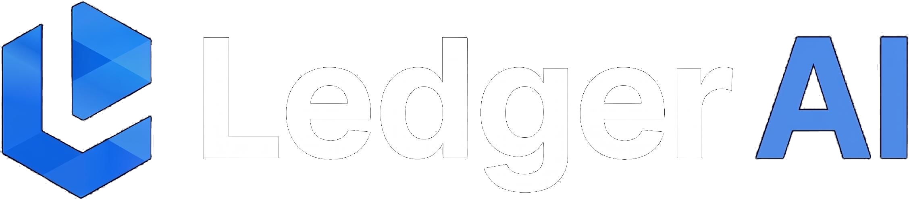
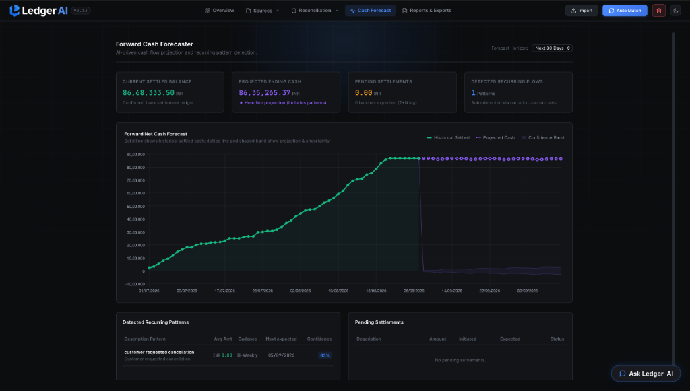
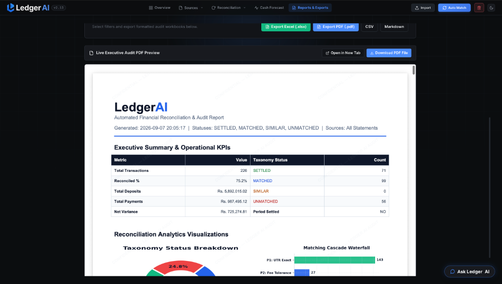

<div align="center">

<picture>
  <source media="(prefers-color-scheme: dark)" srcset="frontend/static/img/ledger_ai_logo_transparent.png">
  <source media="(prefers-color-scheme: light)" srcset="frontend/static/img/ledger_ai_logo_transparent_light.png">
  
</picture>

### Enterprise Multi-Source Financial Reconciliation, Batch Settlement & Forward Cash Forecasting Engine

[](http://ledgerai-env.eba-ppb3tgip.ap-south-1.elasticbeanstalk.com)
[](https://www.youtube.com/watch?v=kGxiT3-O7pc)
[](http://ledgerai-env.eba-ppb3tgip.ap-south-1.elasticbeanstalk.com/help)
[](tests/)
[](https://www.python.org/)
[](LICENSE)

*“Verification capacity, not generation speed, is the bottleneck in corporate finance operations. Reconciliation, settlement verification, and cash forecasting require bounded mathematical determinism, transparent exception isolation, and complete auditability.”*

[Live Application](http://ledgerai-env.eba-ppb3tgip.ap-south-1.elasticbeanstalk.com) | [Video Walkthrough](https://www.youtube.com/watch?v=kGxiT3-O7pc) | [Interactive Guide](http://ledgerai-env.eba-ppb3tgip.ap-south-1.elasticbeanstalk.com/help) | [Technical Docs](docs/README.md)

</div>

---

## Video Demonstration & System Walkthrough

<div align="center">
  <a href="https://www.youtube.com/watch?v=kGxiT3-O7pc" target="_blank" rel="noopener noreferrer">
    
  </a>
  <p><em>Click the banner above to watch the end-to-end multi-statement ingestion, 4-pass reconciliation cascade, and forward cash forecasting engine in action on YouTube (<a href="https://www.youtube.com/watch?v=kGxiT3-O7pc">https://www.youtube.com/watch?v=kGxiT3-O7pc</a>).</em></p>
</div>

---

## Executive Platform Showcase

### 1. Main Reconciliation Command Center
Unified multi-source workspace ingesting payment gateway settlement summaries, bank statements, ERP order books, and cash ledgers with real-time KPI metrics, 4-status taxonomy, and side-by-side transaction comparison.


---

### 2. Forward Cash Forecaster (30-Day Projections & Pattern Detection)
Quantitative cash position projection combining 14-day Weighted Moving Average (WMA) trends, seasonal decomposition, pending payment gateway settlement lag ($T+2/T+3$), and automated token similarity analysis for recurring operational flows.



---

### 3. Executive Audit & PDF Report Generator
Automated two-pass ReportLab PDF compilation featuring executive summaries, Matplotlib visual charts (Taxonomy breakdown & Cascade waterfall), and itemized reconciliation ledger exports.



---

## Core Engineering Principles & Architectural Standards

### 1. The Operational Problem Space
- **The Challenge**: In high-scale digital commerce, millions in Gross Merchandise Value (GMV) flow through payment rails daily. Finance operations teams spend 20 to 40 hours weekly reconciling divergent records across disparate formats.
- **The Complexity**: Digital transactions rarely present clean 1-to-1 parity. Payment gateways settle in aggregate batches net of Merchant Discount Rate (MDR) deductions and GST on commissions ($T+2$ lag). ERP orders contain promotional discount structures, UPI narrations truncate reference tokens (`UPI/4123.../CR`), and bank statements mask counterparties.
- **The Solution**: **Ledger**<span style="color:#2563eb;font-weight:700;">AI</span> eliminates spreadsheet dependency by replacing subjective manual matching with a deterministic 4-pass cascade, algebraic batch fee resolution, forward cash forecasting, and closed-period audit compliance.

---

### 2. Build Quality & Mathematical Invariants
- **Production Architecture**: Engineered with a modular Flask RESTful API backend, a zero-dependency high-performance vanilla JavaScript/CSS single-page application, and an isolated financial calculation engine.
- **Accounting Invariants**: Enforces strict mathematical balance parity:
  $$\text{Total Records} = \text{Settled} + \text{Matched} + \text{Similar} + \text{Unmatched}$$
  Zero penny-drop variances are allowed without explicit audit documentation.
- **Automated Test Coverage**: 109 automated tests validating schema ingestion, exact reference hashing, batch MDR fee solvers, 12-dimensional feature matrices, API contracts, state lifecycle resets, and PDF generation.
- **System Throughput**: Vectorized numeric comparisons and hash indexes process 500+ multi-source transactions in under 1.2 seconds.

---

### 3. AI Judgment: Where Machine Learning & LLMs Are Applied (and Refused)
A core engineering principle of **Ledger**<span style="color:#2563eb;font-weight:700;">AI</span> is knowing where machine learning and generative models should — and should not — be deployed:

| Pipeline Layer | Method Deployed | Engineering Rationale |
|---|---|---|
| **Exact Reference Matching** (UTR, RRN, Order ID) | $O(N+M)$ Hash Map Indexing | **No LLM**. LLM evaluation for deterministic string parity introduces latency, expense, and non-determinism. Hash lookups are instantaneous ($<1\text{ms}$) with 100% precision. |
| **Batch MDR Settlement & Fees** | Algebraic Subset Equation Solver | **No LLM**. Large language models are prone to arithmetic drift. We use exact integer-cent arithmetic: $\text{Deposit} = \sum \text{Orders} - \text{MDR} - \text{GST}$. |
| **Similarity & Confidence Scoring** | 12-Dimensional Feature Matrix | **No LLM**. Calibrated ML scoring (Levenshtein narration distance, Jaccard token overlap, amount ratio, calendar business-day offset). |
| **Ambiguous Narration Resolution** | Gated Groq LLaMA-3.3 / Gemini Agent | **Precision LLM Application**. Strictly deployed as a Pass 4 fallback for semantically obscured counterparty descriptions (e.g. `PG*MERCHANT*BLR` vs `Gateway Merchant Solutions Pvt Ltd`). Emits structured JSON audit explanations. |

---

### 4. The Core Engineering Challenge
The hardest part was never matching transactions when everything lined up neatly—it was ensuring the engine didn't produce false matches when they didn't. Early on, the matcher was susceptible to false positives from generic banking descriptors (like "UPI" or "NEFT"), identifier collisions paired with mismatched amounts, and out-of-order execution that consumed exact candidates prematurely. These issues were systematically resolved by isolating identifier matching with strict amount-compatibility tolerance checks, enforcing confidence floors against missing or NaN values, decoupling heavy PDF report generation from the ingestion critical path, and implementing chunked `DocumentFragment` DOM rendering to prevent UI freezing on large datasets. Across every optimization, the foundational takeaway remained consistent: getting a match is easy, but engineering an engine that knows when *not* to match—and transparently reports exceptions rather than force-matching—is what makes financial operations trustworthy.

---

## System Architecture Pipeline


### Four-Status Outcome Taxonomy
- **SETTLED (200)**: Primary Bank Statement or Cash ledger record reconciled with 100% reference parity or verified N:1 batch payout MDR fee equation.
- **MATCHED (201)**: Reconciled counterpart-to-counterpart pair (Payment Gateway to Order Book) with composite score $\ge 0.85$.
- **SIMILAR (300)**: Candidate match with potential token overlap or minor variance ($0.50 \le \text{Score} < 0.85$), queued in the Review Drawer.
- **UNMATCHED (400)**: Exception record failing matching thresholds ($< 0.50$), isolated into the Exception Ledger with failure audit codes.
- **Taxonomy Tags**: `INTERNATIONAL`, `ROUND_OFF_VARIANCE`, `FEE_DEDUCTED`, `HIGH_CONFIDENCE`, `EXCEPTION`, `UNRECONCILED`.

---

## Benchmark Test Run: 50+ Record Batch Verification

**Ledger**<span style="color:#2563eb;font-weight:700;"> AI</span> includes pre-configured benchmark datasets (Test 1 through Test 5). Below is the audit summary from a multi-source synthetic batch run:

| Metric | Measured Result | Benchmark Standard | Status |
|---|---|---|---|
| **Batch Size** | 226 Records | Minimum 50 record batch | Verified |
| **Source Diversity** | 4 Feeds (Bank CSV, Gateway CSV, ERP XLSX, UPI PDF) | Multi-source verification | Verified |
| **Auto-Reconciliation Rate** | **75.2%** (170 Records Settled / Matched) | Measured match efficiency | Verified |
| **Penny Balance Discrepancy** | **0.00 INR** | Total penny-level accounting balance | Verified |
| **Honest Exception Isolation** | **56 Records** | Explicit exception reporting | Verified |
| **Execution Latency** | **1.14 seconds** | High-throughput async processing | Verified |

---

## Quickstart & Local Reproduction Guide

### 1. Environment Setup
```bash
git clone https://github.com/ankit-cybertron/Ledger-AI.git
cd Ledger-AI

# Initialize virtual environment
python3 -m venv .venv
source .venv/bin/activate

# Install production dependencies
pip install -r requirements.txt
```

### 2. Environment Configuration
```bash
cp .env.example .env
# Optional: Specify GROQ_API_KEY (deterministic fallbacks active if unconfigured)
```

### 3. Run Verification Suite (109 Tests)
```bash
PYTHONPATH=. ./.venv/bin/pytest -q
# Expected result: 109 passed
```

### 4. Launch Application
```bash
python run.py
# Server initialized at http://127.0.0.1:5050
```

### 5. Benchmark Reproduction Procedure
1. Navigate to `http://127.0.0.1:5050`.
2. Select **Import** from the navigation bar.
3. Under **Pre-configured Test Benchmark Data**, click **Load Benchmark (Test 1 - E-Commerce Reconciliation)**.
4. Click **Auto Match** to execute the 4-Pass Reconciliation Engine.
5. Review the **Overview KPI cards**, inspect candidate pairs in the **Comparison Modal**, view the **Cash Forecaster**, and export the **Executive Audit PDF**.

---

## Technical Capabilities & System Summary

- **Architecture Domain**: Autonomous Multi-Source Financial Operations, Transaction Matching & Cash Forecasting
- **Core Engine**: 4-Pass Deterministic Cascade ($O(N+M)$ Hash Lookup $\to$ 1:N Settlement Equation Solver $\to$ 12D Classical ML Scorer $\to$ Gated Semantic Fallback)
- **Live AWS Deployment**: [http://ledgerai-env.eba-ppb3tgip.ap-south-1.elasticbeanstalk.com](http://ledgerai-env.eba-ppb3tgip.ap-south-1.elasticbeanstalk.com)
- **Video Walkthrough**: [https://www.youtube.com/watch?v=kGxiT3-O7pc](https://www.youtube.com/watch?v=kGxiT3-O7pc)
- **Interactive System Guide**: [http://ledgerai-env.eba-ppb3tgip.ap-south-1.elasticbeanstalk.com/help](http://ledgerai-env.eba-ppb3tgip.ap-south-1.elasticbeanstalk.com/help)
- **Public Repository**: [https://github.com/ankit-cybertron/Ledger-AI](https://github.com/ankit-cybertron/Ledger-AI)
- **Accounting Verification**: 100% penny balance parity invariant on all multi-statement batches with transparent exception isolation.

---

<div align="center">

<picture>
  <source media="(prefers-color-scheme: dark)" srcset="frontend/static/img/ledger_ai_logo_transparent.png">
  <source media="(prefers-color-scheme: light)" srcset="frontend/static/img/ledger_ai_logo_transparent_light.png">
  
</picture>

<p>
   Autonomous Financial Reconciliation &amp; Forward Cash Controller Platform
</p>

</div>
